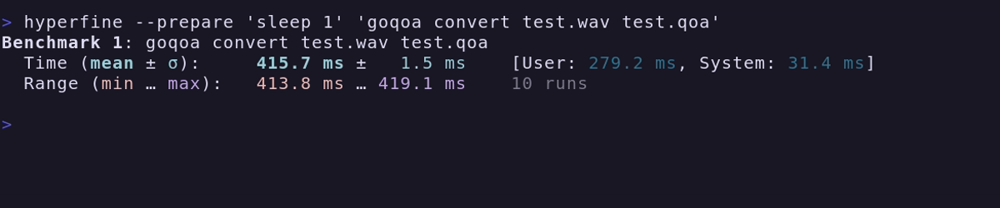

# QOA: Quite OK Audio

> The Quite OK Audio Format for Fast, Lossy Compression.

[](https://github.com/braheezy/goqoa/actions)

A CLI tool for working with audio files following the [QOA Format Specification](https://qoaformat.org/).


Features:

- `convert` WAV, FLAC, OGG, or MP3 files to QOA
- `convert` QOA files to WAV or MP3
- All conversions are in pure Go, no C libraries to install
- `play` QOA file(s)
- Pre-built binaries for Linux, Windows, and Mac

[This blog post](https://phoboslab.org/log/2023/02/qoa-time-domain-audio-compression) by the author of QOA is a great introduction to the format and how it works.

## Install

The easiest way is a pre-built binary on the [Releases](https://github.com/braheezy/goqoa/releases) page. I tested it works on Linux and Windows 10+.

- Linux

```bash
wget -O /usr/bin/goqoa https://github.com/braheezy/goqoa/releases/latest/download/goqoa-linux
chmod +x /usr/bin/goqoa
```

- Mac

```zsh
wget -O /usr/bin/goqoa https://github.com/braheezy/goqoa/releases/latest/download/goqoa-mac
chmod +x /usr/bin/goqoa
```

- Windows

```powershell
mkdir $HOME\goqoa
iwr "https://github.com/braheezy/goqoa/releases/latest/download/goqoa.exe" -OutFile "$HOME\goqoa\goqoa.exe"
$env:Path += ";$HOME\goqoa"
[System.Environment]::SetEnvironmentVariable("Path", $env:Path, "User")
```

Otherwise, install [prerequisites](https://github.com/ebitengine/oto#prerequisite) for your platform:

    # Fedora
    yum install gcc alsa-lib-devel
    # Debian
    apt-get install gcc pkg-config libasound2-dev

Then, install directly with Go:

    go install github.com/braheezy/goqoa/v3@latest

Or, checkout the project, build it from source, and install:

    git clone https://github.com/braheezy/goqoa.git
    cd goqoa
    make install

## `qoa` Package

The library `qoa` has been moved to [this repository](https://github.com/braheezy/qoa) so I could manage the version of the library separate from the `goqoa` CLI.

## Development

You'll need the following:

- Go 1.\*
- `make`
- The [dependencies that `oto` requires](https://github.com/ebitengine/oto#prerequisite)

Then you can `make build` to get a binary.

`make test` will run Go unit tests.

`make` to see all options.

### Reference Testing

This is a rewrite of the QOA implementation, not a transpile of or a CGO wrapper to `qoa.h`. It's a simple enough encoding that the code can be compared side-by-side to ensure the same algorithm has been implemented.

To further examine fidelity, the `check_spec.sh` script can be used. It does the following:

- If required, fetch the [sample pack from the QOA website](https://qoaformat.org/samples/)
- Grab random WAV files from the pack
- `goqoa convert` the file to QOA format and compare against the QOA file created by the reference author
- `goqoa convert` the QOA file back to WAV and compare against the similarly created WAV file by the reference author

The check uses `cmp` to check each byte in each produced file. For an unknown reason, not all files pass this check. The failing files are the exact same size and when played, sound the same. Perhaps it's rounding error differences between Go and C, or bad reference files, or other such noise. It does appear to the same suspect files everytime. Anyway, you have been warned.

- `check_spec.h` to check a small amount of bytes for a small amount of files
- `check_spec.sh -a` to fully check all 150 songs and record `failures`

The `Dockerfile` can also be used to compare against the reference. It builds and installs both `goqoa` and `qoaconv` and provides an entrypoint script to convert WAV file(s) with both tools, then summarize the results.

    docker build . -t qoacompare:latest && docker run --rm -it -v `pwd`:/data  qoacompare /data/test_ultra_new.wav

### Fuzz Testing

The `qoa` package has a fuzz unit test to examine the `Encode()` and `Decode()` functions.

`fuzz/create_fuzzy_files.py` generates valid QOA files with random data.

## Benchmarks

To get a sense of this implementation's encoding speed, I run a simple WAV -> QOA conversion. The timing includes WAV decoding time but that's okay.

My host hardware:

```
$ neofetch
CPU› 13th Gen Intel i5-13600KF (20) @ 5.100GHz
GPU› AMD ATI Radeon RX 6800/6800 XT / 6900 XT
Memory› 7416MiB / 31925MiB
```

Before I did any optimizations, this was the state of the benchmarks


I did some refactoring to reduce memory allocations in `qoa` and updated how I was decoding WAV data. This is what it looks like after:


And the quality of the encoded file didn't go down:

- Before: 
- After: 

---

## Disclaimer

I have never written software that deals with audio files before. I saw a post about QOA on HackerNews and found the name amusing. There were many ports to other languages, but Go was not listed. So here we are!

I developed this with an LLM-based workflow:

- I gave the [formal specification](https://qoaformat.org/qoa-specification.pdf) to `gpt-3.5` via ChatGPT and told it to explain everything I didn't understand about it (which was the entire thing because I don't know anything about audio encoding).
- Next, I gave the entire C reference implementation to `gpt-3.5-turbo-16k` via OpenAI playground because it has the context window to fit the entire file.
- Then we wrote code:
  - `gpt-3.5-turbo-16k` to do the heavy lifting of converting C to Go. I asked it 1 function at a time.
  - `gpt-3.5` to explain and tweak the ported code.
  - Both models helped write unit tests.
- After getting a working decoder/encoder, I worked with ChatGPT to integrate the Cobra framework to implement the CLI.
